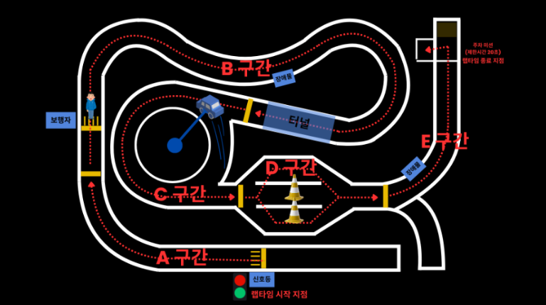
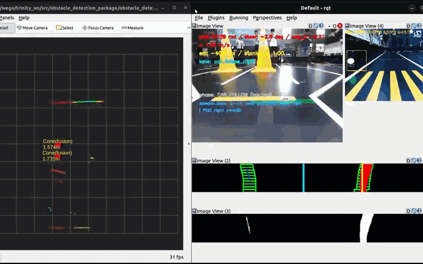
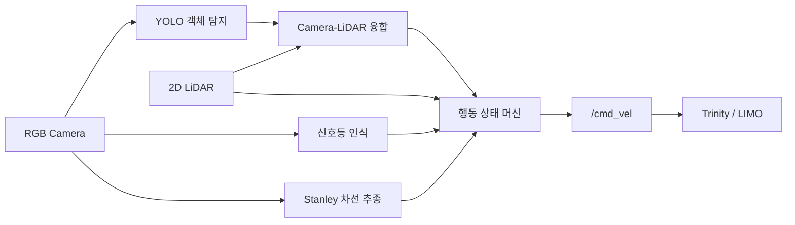

# INHA Capstone — Trinity 자율주행 미션

인하대학교 자율주행 캡스톤 미션을 수행하기 위한 **ROS 2 기반 Trinity/LIMO 주행 시스템**입니다. 카메라와 2D LiDAR를 이용해 신호등·차량·보행자·터널·라바콘을 인지하고, Stanley 차선 추종과 상태 머신을 결합해 출발부터 평행 주차까지 수행합니다.

> 교육 및 실습 자료: [aicastle-school/inha26-summer-ros](https://github.com/aicastle-school/inha26-summer-ros)

## 미션 코스



| 구간 | 미션 내용 | 이 프로젝트의 대응 방식 |
| --- | --- | --- |
| **A. 신호등 출발 / 보행자 대응** | 초록 신호에 맞춰 출발한 뒤 보행자 구간 통과 | 고정 ROI에서 초록 신호를 확인하면 출발하고, YOLO와 LiDAR로 보행자를 인지해 설정 거리 안에서 정지한 뒤 다시 출발 |
| **B. S구간 / U턴 / 터널 구간** | 연속 곡선과 U턴을 통과한 뒤 터널 구간 주행 | Stanley 제어로 차선을 추종하고, 터널에서는 LiDAR로 감지한 좌·우 벽의 중점을 따라 주행 |
| **C. 차량 추종 / 터널 진입** | 지정 위치에서 움직이는 전방 차량을 추종하며 터널 진입 | 차량을 지속 추적해 전방 거리에 따라 정지하거나 속도를 제한하고, 터널 진입 후 양쪽 벽의 중점을 추종 |
| **D. 라바콘 회피** | 경기 시작 전에 무작위로 배치된 라바콘 통과 | 두 콘의 상대 위치로 빈 공간의 가상 waypoint를 실시간 생성하여 좌·우 배치에 대응 |
| **E. 종료선 이후 접근 및 평행 주차** | 종료선을 통과한 뒤 20초 안에 평행 주차 | 마지막 가로 정지선을 감지한 뒤 전방 벽까지 접근하고 사전 기록된 조향 시퀀스로 평행 주차 |

랩타임의 시작·종료 판정과 장애물의 실제 움직임은 경기 운영 측에서 수행하며, 이 저장소는 각 상황을 인지하고 차량을 제어하는 코드를 담고 있습니다.

## 미션별 주행 및 디버깅 영상

각 미션의 **실차 주행 영상**과 **디버깅 영상**을 나란히 배치했습니다. 디버깅 영상에서는 차선 인식, 객체 검출, LiDAR 융합, 상태 전이 등 당시의 판단 근거를 함께 확인할 수 있습니다.

### A. 신호등 출발 / 보행자 대응

| 실차 주행 영상 | 디버깅 영상 |
| --- | --- |
|  |  |

- **핵심 로직:** 고정 ROI에서 초록 신호를 확인하면 출발하고, 이후 YOLO 검출과 LiDAR 클러스터를 결합해 보행자를 인지하여 설정 거리 이내에서는 정지한 뒤 안전하게 다시 출발합니다.

### B. S구간 / U턴 / 터널 구간

| 실차 주행 영상 | 디버깅 영상 |
| --- | --- |
|  |  |

- **핵심 로직:** Stanley 제어로 S구간과 U턴의 차선을 추종하고, 터널에서는 LiDAR로 감지한 좌·우 벽의 대표점 중점을 따라 주행합니다.

### C. 차량 추종

| 실차 주행 영상 | 디버깅 영상 |
| --- | --- |
|  |  |

- **핵심 로직:** 전방 차량을 지속 추적해 거리 기반으로 속도를 조절하거나 정지하여 주행합니다.

### D. 라바콘 회피

| 실차 주행 영상 | 디버깅 영상 |
| --- | --- |
|  |  |

- **핵심 로직:** 가까운 두 개의 콘을 인식한 뒤 상대 위치로 빈 공간의 가상 waypoint를 생성하여 좌·우 배치가 달라도 동일한 로직으로 통과합니다.

### E. 종료선 이후 접근 및 평행 주차

| 실차 주행 영상 | 디버깅 영상 |
| --- | --- |
|  |  |

- **핵심 로직:** 마지막 가로 정지선을 감지한 뒤 전방 기준물까지 접근하고, 조건이 만족되면 `data/parking/cmd_vel_record.json`에 저장된 `(dt, vx, wz)` 시퀀스를 재생해 평행 주차를 수행합니다.

## 시스템 구성



### 주요 ROS 2 패키지

| 패키지 | 역할 | 주요 실행 파일 |
| --- | --- | --- |
| `obstacle_detection_package` | YOLO 추론, 신호등 판별, 카메라-LiDAR 융합 및 장애물 추적 | `yolov8n_node`, `traffic_light_perception_node`, `cam_lidar_fusion_node` |
| `decision_making_package` | 차선 검출·Stanley 제어, 미션 상태 전이, 주차 기록/재생 | `my_test_stanley`, `final_test_state_machine`, `cmd_vel_record_replay_node` |
| `bringup_trinity` | 센서·차량 및 자율주행 노드 통합 실행 | `starting_trinity.launch.py`, `trinity_bringup.launch.py` |

최종 통합 런치는 다음 노드를 함께 실행합니다.

1. `yolov8n_node`: 카메라 영상에서 `Cone`, `Person`, `Box`, `Car`, `Tunnel` 검출
2. `cam_lidar_fusion_node`: 검출 bbox와 `/scan`을 결합해 차량 기준 장애물 좌표 생성
3. `traffic_light_perception_node`: 초록 신호 확정 후 출발 신호 발행
4. `my_test_stanley`: 차선 중심을 추종하고 마지막 가로 정지선 감지
5. `final_test_state_machine`: 미션 우선순위에 따라 최종 속도 명령 발행

### 핵심 토픽

| 토픽 | 타입 | 설명 |
| --- | --- | --- |
| `/camera/color/image_raw` | `sensor_msgs/Image` | 객체 및 신호등 인식용 원본 영상 |
| `/camera/color/image_raw/compressed` | `sensor_msgs/CompressedImage` | 차선 추종용 압축 영상 |
| `/scan` | `sensor_msgs/LaserScan` | 장애물 위치 융합과 주차 전방 거리 |
| `/detections` | `vision_msgs/Detection2DArray` | YOLO 2D 검출 결과 |
| `/obstacles/fused` | `std_msgs/String` | JSON 형식의 융합 장애물 목록 |
| `/traffic_light` | `std_msgs/String` | 출발 신호 (`Green`) |
| `/stanley/cmd_vel` | `geometry_msgs/Twist` | 차선 추종기가 만든 기본 제어 명령 |
| `/behavior/phase` | `std_msgs/String` | `NORMAL`, `CONE`, `TUNNEL`, `LAST_CURVE`, `PARKING` 등 현재 단계 |
| `/lane/last_lane_detected` | `std_msgs/Bool` | 마지막 가로 정지선 감지 결과 |
| `/cmd_vel` | `geometry_msgs/Twist` | 상태 머신을 거친 최종 차량 명령 |

## 동작 환경

- ROS 2 Humble 기반 환경
- RGB 카메라 (`/camera/color/image_raw`, compressed 토픽 포함)
- 2D LiDAR (`/scan`)
- CUDA/TensorRT를 사용할 수 있는 Jetson 계열 장비 권장
- Python 패키지: `ultralytics`, `opencv-python`, `numpy`
- ROS 메시지/브리지: `cv_bridge`, `vision_msgs`, `visualization_msgs`

차량과 센서를 구동하는 `wego`, `limo_base`, `limo_description`, `orbbec_camera`, `ydlidar_ros2_driver` 패키지는 이 저장소에 포함되어 있지 않습니다. 교육 환경 또는 [교육자료 저장소](https://github.com/aicastle-school/inha26-summer-ros)의 설치 절차에 따라 먼저 준비해야 합니다.

## 빌드

이 저장소를 ROS 2 workspace로 사용합니다.

```bash
cd ~/trinity_ws
source /opt/ros/humble/setup.bash

rosdep install --from-paths src --ignore-src -r -y
colcon build --symlink-install
source install/setup.bash
```

저장소를 다른 경로에 clone했다면 첫 번째 `cd`만 실제 경로로 바꾸면 됩니다. 새 터미널을 열 때마다 ROS 2와 workspace의 `setup.bash`를 다시 source해야 합니다.

## 실행

### 1. 차량과 센서 실행

```bash
ros2 launch bringup_trinity starting_trinity.launch.py
```

RViz도 함께 실행하려면 다음과 같이 지정합니다.

```bash
ros2 launch bringup_trinity starting_trinity.launch.py viz:=true
```

### 2. 자율주행 스택 실행

새 터미널에서:

```bash
source /opt/ros/humble/setup.bash
source ~/trinity_ws/install/setup.bash

ros2 launch bringup_trinity trinity_bringup.launch.py \
  model_path:=$HOME/trinity_ws/obstacle.engine \
  debug:=false
```

미션별 기능은 런치 인자로 켜고 끌 수 있습니다.

```bash
ros2 launch bringup_trinity trinity_bringup.launch.py \
  model_path:=$HOME/trinity_ws/obstacle.engine \
  enable_traffic_light:=true \
  enable_car_follow:=true \
  enable_cone:=true \
  enable_tunnel:=true \
  enable_person:=true \
  debug:=true
```

`trinity_bringup.launch.py`의 기본 모델 경로와 주차 기록 경로는 `~/trinity_ws`를 기준으로 합니다. 다른 경로에서 실행할 때는 `model_path`를 명시하고, `final_test_state_machine.py`의 `PARKING_RECORD_FILE`도 실제 `data/parking/cmd_vel_record.json` 위치에 맞춰야 합니다.

## 객체 인식 모델

| 파일 | 용도 |
| --- | --- |
| `weights/best.pt` | 학습된 PyTorch 가중치 |
| `weights/best.onnx` | ONNX 변환 모델 |
| `weights/best.engine` | TensorRT FP16 엔진 |
| `weights/pre_obstacle.engine` | 이전/비교용 TensorRT 엔진 |
| `obstacle.engine` | 통합 런치에서 사용하는 배포용 엔진 |

TensorRT 엔진은 GPU 아키텍처와 CUDA/TensorRT 버전에 종속됩니다. 저장된 `.engine`이 현재 Jetson에서 역직렬화되지 않으면 해당 장비에서 다시 빌드합니다.

```bash
python3 -m pip install ultralytics
python3 weights/build_engine.py
```

스크립트는 `weights/best.pt`를 FP16 TensorRT 엔진으로 변환한 뒤 프로젝트 루트의 `obstacle.engine`으로 복사합니다.

## 상태 머신과 미션 처리

대표적인 상태 전이는 아래와 같습니다.

```text
WAITING_GREEN
  └─ Green → DRIVING
       ├─ 보행자 → PERSON_STOP → PERSON_PASS → DRIVING
       ├─ 라바콘 → CONE_APPROACH → CONE_W1 → CONE_ESCAPE → CONE_ESCAPE2
       ├─ 터널   → TUNNEL → DRIVING
       └─ 종료선 → PARKING_APPROACH → PARKING_REPLAY → PARKING_DONE
```

- **신호등:** 화면 왼쪽의 고정 ROI에서 초록 픽셀 비율이 연속 프레임 기준을 넘으면 한 번만 `Green`을 발행합니다.
- **앞차/보행자:** YOLO 검출을 LiDAR 클러스터와 융합하고, 잠시 검출이 끊겨도 seed 주변 클러스터를 추적합니다.
- **라바콘:** 가까운 콘을 중앙콘으로 두고 `W1 = 2 × 중앙콘 - 측면콘` 위치에 빈 공간 waypoint를 만듭니다.
- **터널:** 좌·우 벽의 대표점을 찾고 두 벽의 횡방향 중점으로 조향합니다.
- **평행 주차:** 마지막 정지선 이후 전방 거리가 기준값에 도달하면 `data/parking/cmd_vel_record.json`의 `(dt, vx, wz)` 시퀀스를 재생합니다.

## 주차 궤적 다시 기록하기

기본 주차 시퀀스는 [`data/parking/cmd_vel_record.json`](./data/parking/cmd_vel_record.json)에 저장되어 있습니다. 사람이 읽기 쉬운 변환본은 [`cmd_vel_record_readable.txt`](./data/parking/cmd_vel_record_readable.txt)에서 확인할 수 있습니다. 별도로 기록/재생 노드를 시험하려면 다른 `/cmd_vel` 발행 노드와 충돌하지 않도록 한 뒤 사용합니다.

```bash
ros2 run decision_making_package cmd_vel_record_replay_node \
  --ros-args -p auto_trigger:=false -p record_file:=$HOME/trinity_ws/data/parking/cmd_vel_record.json

ros2 topic pub -1 /cmd_vel_record/start std_msgs/msg/Bool "{data: true}"
# 원하는 주차 동작 수행
ros2 topic pub -1 /cmd_vel_record/stop std_msgs/msg/Bool "{data: true}"
ros2 topic pub -1 /cmd_vel_record/replay std_msgs/msg/Bool "{data: true}"
```

긴급 취소:

```bash
ros2 topic pub -1 /cmd_vel_record/cancel std_msgs/msg/Bool "{data: true}"
```

## 디버깅

```bash
ros2 topic echo /behavior/phase
ros2 topic echo /traffic_light
ros2 topic echo /obstacles/fused
ros2 topic hz /camera/color/image_raw
ros2 topic hz /scan
```

시각화용 토픽:

- `/yolo/result`: YOLO bbox가 표시된 영상
- `/traffic_light/debug`: 신호등 ROI와 색상 비율
- `/roi_img`, `/binary_img`, `/debugging_image1`, `/debugging_image2`: 차선 검출 중간 결과
- `/obstacles/markers`: 융합 장애물 RViz marker
- `/behavior/waypoints`: 라바콘 가상 waypoint RViz marker

## 저장소 구조

```text
inha-capstone/
├── src/
│   ├── bringup_trinity/             # 하드웨어 및 통합 launch
│   ├── obstacle_detection_package/  # YOLO, 신호등, Camera-LiDAR fusion
│   └── decision_making_package/      # Stanley, 상태 머신, 평행 주차
├── assets/
│   ├── gifs/                         # 미션별 실차 및 디버깅 영상
│   │   ├── mission_a_real.gif
│   │   ├── mission_a_debug.gif
│   │   ├── mission_b_real.gif
│   │   ├── mission_b_debug.gif
│   │   ├── mission_c_real.gif
│   │   ├── mission_c_debug.gif
│   │   ├── mission_d_real.gif
│   │   ├── mission_d_debug.gif
│   │   ├── mission_e_real.gif
│   │   └── mission_e_debug.gif
│   └── images/
│       └── track.png                 # 미션 코스 이미지
├── data/
│   └── parking/
│       ├── cmd_vel_record.json       # 평행 주차 제어 시퀀스
│       └── cmd_vel_record_readable.txt # 사람이 읽기 쉬운 주차 기록
├── weights/                          # PT, ONNX, TensorRT 모델과 변환 스크립트
├── obstacle.engine                   # 기본 배포용 TensorRT 엔진
└── extract_images.py                 # ROS bag 학습 이미지 추출 도구
```

## 주의 사항

- 실제 차량에 연결하기 전 바퀴를 띄우거나 충분한 안전 공간을 확보해 `/cmd_vel` 방향과 크기를 확인하세요.
- `final_test_state_machine`과 독립 `cmd_vel_record_replay_node`를 동시에 실행하면 `/cmd_vel` 명령이 충돌할 수 있습니다.
- `obstacle.engine`을 다른 Jetson으로 옮겼다면 TensorRT 호환 여부를 먼저 확인하세요.
- 트랙 조명, 카메라 각도, LiDAR 장착 위치가 달라지면 각 노드 상단의 ROI·거리·속도·조향 상수를 재튜닝해야 합니다.
- `package.xml`에는 일부 Python/ROS 실행 의존성이 선언되어 있지 않으므로, 빌드가 성공해도 실행 환경에 `ultralytics`, OpenCV, NumPy, `cv_bridge`, `vision_msgs`가 필요합니다.
